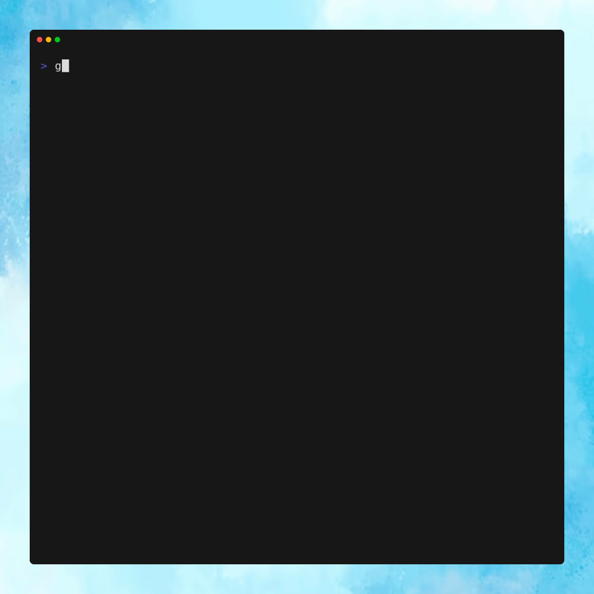

# Photosorter

 

Photosorter is a CLI tool designed for sorting your photos by their original creatuion date.
Powered by [Cobra](https://github.com/spf13/cobra) and [Go-exif](https://github.com/dsoprea/go-exif).

## Usage

The `sort` command requires two arguments: the source directory `src` containing the target photos, and the destination directory `dst` where the sorted photos will be output.
Additionally, you can use the `--format` flag to choose the output structure directory. It accepts `month` and `year` as options.